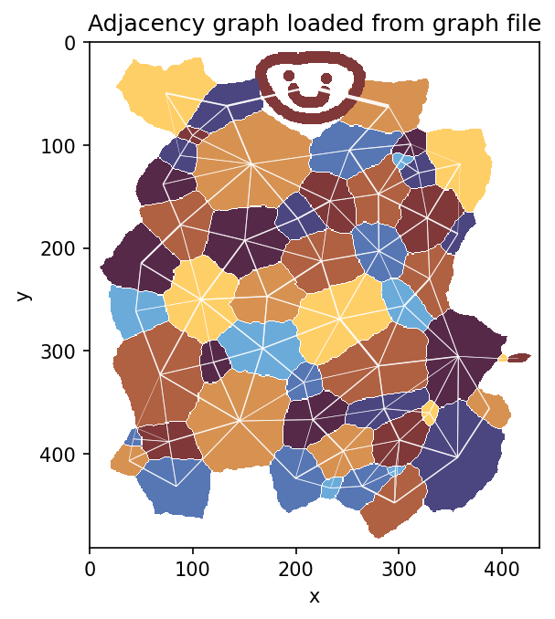
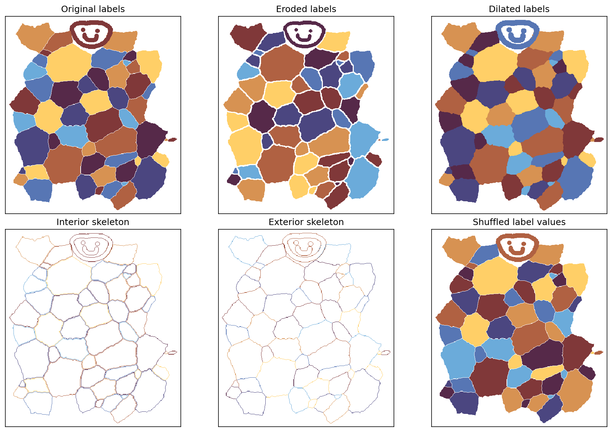
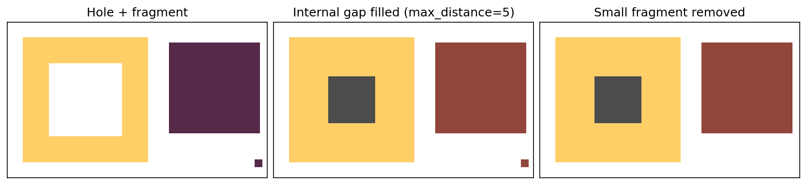

# labelimage-tools cookbook

This cookbook shows the core workflows for 2-D labeled tissue segmentation images. 

The images shown here are generated by the scripts in `examples/` and saved under `examples/plots/`.

## Graph-colored label images

Graph coloring assigns colors so neighboring labels are visually separated. The example uses the cyclic `managua` colormap with `cyclic_cmap=True`, which is a nice fit for categorical label displays.

```bash
python examples/01_graph_coloring.py
```

Core snippet:

```python
import labelimage_tools as lit

# The default pipeline crops foreground, removes disconnected fragments,
# and fills internal gaps so labels are clean, self-connected, unique regions
# ready for adjacency, contour, and junction operations. Neighboring labels
# touch across filled internal gaps instead of being separated by stray holes.
labels = lit.load_image_pipeline("samples/test_cells2D.tif")

fig, ax = lit.plot_label_image(
    labels,
    use_graph_coloring=True,
    K=8,
    seed=4,
    cmap="managua",
    cyclic_cmap=True,
    title="Graph-colored label image",
)
```


The same script also shows label boundaries:


## Adjacency graph I/O

Graph I/O preserves original label IDs as graph node IDs. Contact values are neighboring pixel-pair counts, useful as graph weights but not exact geometric lengths.

```bash
python examples/04_graph_io.py
```

Core snippet:

```python
neighbors, contacts, centroids, pixel_counts = lit.graph_from_labels(labels)
lit.save_label_graph(
    "examples/plots/label_graph.npz",
    neighbors,
    contacts=contacts,
    centroids=centroids,
    pixel_counts=pixel_counts,
)
loaded = lit.load_label_graph("examples/plots/label_graph.npz")
```



## Preprocessing operations

Preprocessing helpers operate label-by-label while preserving label values. This example demonstrates erosion, dilation, interior/exterior skeletons, and label shuffling on the bundled sample.

```bash
python examples/02_preprocessing_gallery.py
```

Core snippet:

```python
labels = lit.load_image_pipeline("samples/test_cells2D.tif")

eroded = lit.erode_labels(labels, structure=3, background=0)
dilated = lit.dilate_labels(labels, structure=3, background=0, background_only=True)
interior = lit.skeletonize_labels(labels, background=0, kind="interior")
exterior = lit.skeletonize_labels(labels, background=0, kind="exterior")
shuffled = lit.shuffle_labels(labels, seed=7, background=0)
```



## Filling gaps and removing fragments

Internal background holes can be filled by nearest-label assignment, and labels split into multiple disconnected components can be cleaned by keeping only the largest component. 

```python
filled = lit.fill_internal_gaps_edt(labels, background=0, max_distance=3)
cleaned = lit.remove_non_self_connected_bits(filled, background=0)
```

If holes are too big, `max_distance` can be used to define how far a label may extend. Unassigned pixels are assigned a new out of bounds label, here displayed in gray.



## Junction finding

Junction pixels are pixels whose 3×3 neighborhood contains at least three distinct labels. Connected junction pixels are clustered into `Junction` objects with `(y, x)` centroids, member pixels, and label sets.

```bash
python examples/03_junctions_and_contours.py
```

Core snippet:

```python
labels = lit.load_image_pipeline("samples/test_cells2D.tif")

junction_label_image, junctions = lit.junctions_from_labels(
    labels,
    background=0,
    min_labels=3,
    connectivity=2,
)
fig, ax = lit.plot_label_image(labels, cmap="managua", cyclic_cmap=True)
lit.plot_junctions(junctions=junctions, junction_mask=junction_label_image > 0, ax=ax)
```


## Contours

Contours are returned in image-coordinate order `(y, x)`. The plotting helper converts them to matplotlib display coordinates when drawing.

```python
labels = lit.load_image_pipeline("samples/test_cells2D.tif")

contours = lit.ordered_contours_from_labels(labels, background=0)
fig, ax = lit.plot_label_image(labels, cmap="managua", cyclic_cmap=True)
lit.plot_contours(labels, ax=ax, background=0, color="black", linewidth=0.6)
```


You can also combine contours and junctions in one inspection figure:


